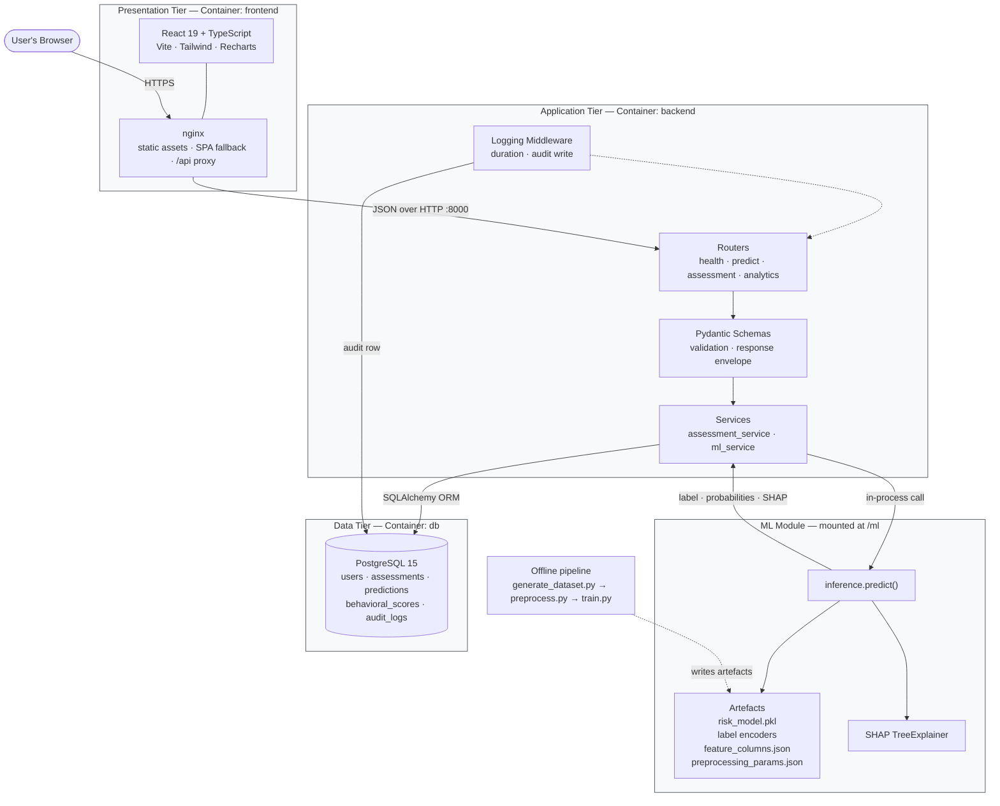
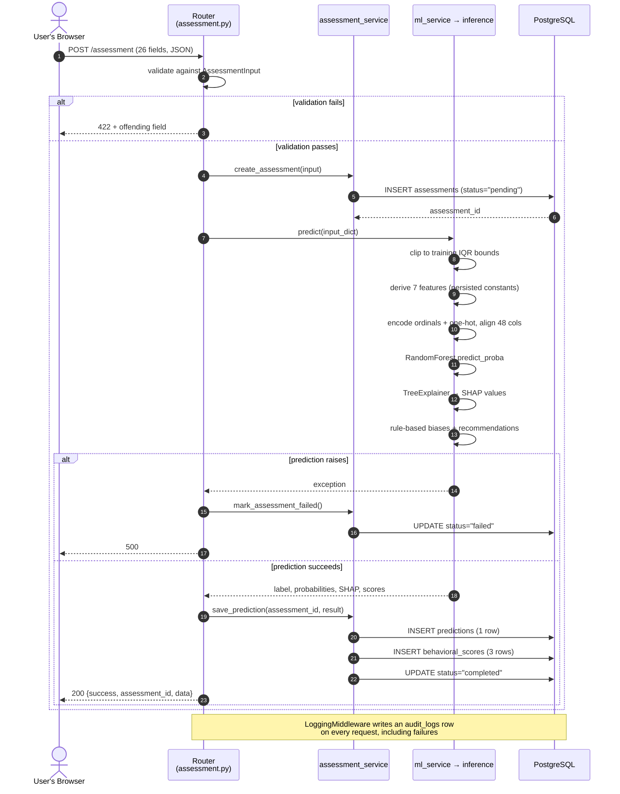

# 11. Architecture Diagram

Two diagrams describe the system. The first is a block diagram of the deployment and the data that crosses each boundary. The second is a sequence diagram of a single assessment request, which is the artefact that demonstrates the components actually cooperate.

Both are maintained as Mermaid source in `docs/report/11_architecture_diagram.md` and rendered to vector graphics during the build, so the figures printed here cannot drift from the description in the text. The source may also be pasted into any Mermaid-aware editor, or into draw.io via *Arrange → Insert → Advanced → Mermaid*, and exported as PNG or SVG for use elsewhere.

## 11.1 Deployment and Data Flow

**Three details to check on the rendered figure.** The call from the service into the inference module is an in-process arrow, not a network arrow, because it is a Python function call within a single interpreter — Section 10.4 explains why that boundary was not made a service. The offline pipeline is drawn with a dashed edge, since it does not run at request time and only deposits artefacts; the artefact it deposits that matters most is `preprocessing_params.json`, which is what prevents the training and serving feature computations from diverging (Section 22.4). And the middleware writes to PostgreSQL along its own edge rather than through `assessment_service`, which is why the audit log survives a failed prediction.

## 11.2 Request Sequence for `POST /assessment`

**Why the sequence is drawn this way.** The `assessments` row is inserted and committed *before* the model is invoked. That ordering is what makes the `failed` status meaningful: had both writes shared one transaction, a failed prediction would roll back the assessment and leave no evidence the attempt occurred. Section 20.4 argues the point.

The four steps inside the inference lifeline are drawn separately rather than collapsed into one call, because they are precisely the steps that were implemented twice and disagreed. Section 22.4 documents the five divergences.

## 11.3 Labelling Conventions

Should the diagrams be redrawn by hand for the report rather than rendered from source, the following should be preserved.

| Element | Convention |
|---|---|
| Container boundary | labelled with the Docker Compose service name |
| Solid edge | a runtime path exercised by a live request |
| Dashed edge | an offline dependency; no request traverses it |
| Cylinder | a persistent store |
| Edge label | what crosses the boundary, not how |
| In-process call | drawn without a protocol label, to distinguish it from HTTP |

The last convention matters. A reader who sees an unlabelled arrow between the service and the ML module should understand that no serialisation, no network hop and no schema translation occurs there — which is the design decision Section 20.1 defends, and the reason a Spring Boot backend was not used.

---

> **Figure 11.1** — *Deployment and data-flow architecture.* Rendered from the source in §11.1. Solid edges are runtime paths; the dashed edge is an offline artefact dependency.

> **Figure 11.2** — *Sequence diagram for `POST /assessment`.* Rendered from the source in §11.2. Referenced as Figure 10.1 from Section 10.6 and as Figure 18.1 from Section 18; it appears once here and is cross-referenced from both. It is the single strongest piece of evidence that the system functions end to end, and should be reproduced at full column width.
