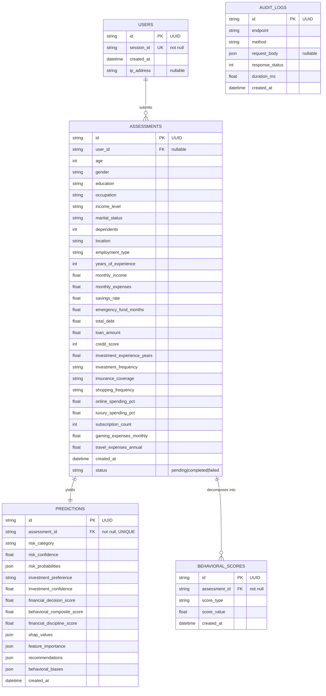

# 17. Database Design

## 17.1 Choice of Store

The data this system produces is relational in the ordinary sense: an assessment has exactly one prediction, a prediction is meaningless without the assessment that produced it, and the analytics view is a set of aggregate queries over those two tables. A relational store was therefore the obvious fit, and PostgreSQL was selected for its native `JSONB` support, which matters because three columns hold structures whose shape is fixed but whose contents vary in length.

SQLite is retained as a development target. Both are reached through the same SQLAlchemy declarative layer, and the schema is expressed once. Where the two dialects genuinely diverge, the divergence is handled explicitly rather than papered over — the daily-count aggregation in `/analytics` inspects `db.bind.dialect.name` and emits `strftime` for SQLite or `to_char` for PostgreSQL.

## 17.2 Entities

Five tables are declared.

**`users`** — a session identifier, creation timestamp and originating IP address, keyed by UUID.

**`assessments`** — the twenty-six submitted inputs stored as first-class columns, together with a creation timestamp and a `status` field taking `pending`, `completed` or `failed`. A nullable foreign key points at `users`.

**`predictions`** — one row per assessment, enforced by a unique constraint on `assessment_id`. Holds the predicted risk category and its confidence, the predicted investment preference and its confidence, the three derived scores, and four `JSON` columns: `risk_probabilities`, `shap_values`, `feature_importance`, `recommendations` and `behavioral_biases`.

**`behavioral_scores`** — a narrow table storing a `score_type` and `score_value` per assessment. Three rows are written per prediction, one each for the behavioural composite, financial discipline and decision scores.

**`audit_logs`** — endpoint, HTTP method, request body, response status and duration in milliseconds, written by middleware on every request.

## 17.3 Entity–Relationship Diagram

`AUDIT_LOGS` is drawn without a relationship because it holds none. It records HTTP traffic rather than domain objects, and deliberately carries no foreign key to `assessments`; an audit trail that could be broken by a cascade delete would defeat its purpose.

## 17.4 Normalisation

The schema is in first normal form: every column holds a single value, and the repeating structures are confined to the `JSON` columns, which store an atomic document rather than a repeating group of relational attributes.

It satisfies second normal form trivially, since every primary key is a single UUID column and no partial dependency on a composite key is possible.

Third normal form holds for `predictions`, `users` and `audit_logs`, where every non-key attribute depends on the key alone. **It does not strictly hold for `assessments`.** Two functional dependencies exist among the non-key attributes. `savings_rate` is determinable from `monthly_income` and `monthly_expenses`, and `income_level` is a coarse banding of `monthly_income`. A purist would remove `savings_rate` and derive it in a view.

Both were kept, and the reason is worth stating rather than hiding. `savings_rate` is what the user asserted, and it need not equal the value implied by the income and expenses they also reported — people round, and they exclude irregular income. Storing the assertion preserves what was actually submitted, which is the property an audit trail requires. The same argument applies to `income_level`, which is self-reported rather than computed. The redundancy is accepted as the cost of recording the input faithfully.

A second and less defensible redundancy exists between `behavioral_scores` and `predictions`. The three score values written to `behavioral_scores` already appear as columns on the corresponding `predictions` row. The narrow table exists to support querying scores by type without knowing the column names, but it stores derived data that is recoverable from elsewhere, and it must be kept consistent by application code rather than by a constraint. Were the schema to be revised, `behavioral_scores` would be replaced by a view.

## 17.5 Keys, Constraints and Integrity

Primary keys are UUIDs generated in Python at insert time rather than sequences generated by the database. The motivation is that an identifier can be minted before the row exists, which simplifies the write path, and identifiers do not leak the number of assessments the system has processed.

The one-to-one relationship between `assessments` and `predictions` is enforced by a unique constraint on `predictions.assessment_id`, not merely by the ORM's `uselist=False`. The database rejects a second prediction for an assessment regardless of what the application attempts.

Referential integrity is declared through foreign keys on `assessments.user_id`, `predictions.assessment_id` and `behavioral_scores.assessment_id`. No cascade behaviour is specified, so a delete against a referenced parent raises rather than propagating. Since the application never deletes, this has not been exercised.

Write consistency for the assessment path relies on the SQLAlchemy session's transaction. The prediction row and the three score rows are added and committed together, so a failure part-way leaves none of them. The assessment row is committed earlier, which is what makes the `failed` status meaningful — the row survives to record that a prediction was attempted and did not complete.

## 17.6 Known Deficiencies

Three shortcomings in the current schema should be recorded rather than glossed over, because each would need addressing before the system carried real traffic.

**The `users` table is never written to.** It is declared, related to `assessments`, and created at startup, but no code path instantiates a `User`, and `assessments.user_id` is consequently always null. Authentication was scoped out of the implementation, and without it there is no principal to record. The table is therefore vestigial, and the relationship it participates in is unexercised. It is retained because the analytics and history features would attach to it directly once sessions exist.

**No secondary indexes are declared.** Every index in the schema is the one implied by a primary or unique key. The queries that will degrade first are the history listing, which orders `assessments` by `created_at` descending, and the analytics aggregations, which group `predictions` by `risk_category` and `investment_preference`. At the current data volume the sequential scans are imperceptible. An index on `assessments.created_at` and on the two grouped columns of `predictions` would be the first change under load.

**Schema migrations are not in use.** An `alembic/` directory exists but is empty, and the schema is materialised at startup by `Base.metadata.create_all()`. That call creates missing tables and silently ignores tables whose definition has drifted, so an altered column type will never be applied to an existing database. For development against a disposable SQLite file this is adequate. For a PostgreSQL instance holding data it is not, and generating an initial Alembic revision is the correct next step.

---

> **Figure 17.1** — *Entity–relationship diagram.* Rendered from the `erDiagram` source in §17.3. If the `assessments` entity makes the figure too wide for the printed page, collapse its twenty-six input columns into three grouped rows labelled *Demographic (10)*, *Financial (10)* and *Lifestyle (6)*, and give the full column list in Table 17.1.

> **Table 17.1** — *Column dictionary for `assessments`.* Columns: name, SQL type, source (demographic / financial / lifestyle), permitted values or range. Populate from `backend/app/schemas/assessment.py`, which carries the authoritative bounds. Place after Figure 17.1.

> **Table 17.2** — *Normal-form assessment per table.* Rows: the five tables. Columns: 1NF, 2NF, 3NF, and a note. Mark `assessments` as violating 3NF with the reason from Section 17.4. Place at the end of Section 17.4.
